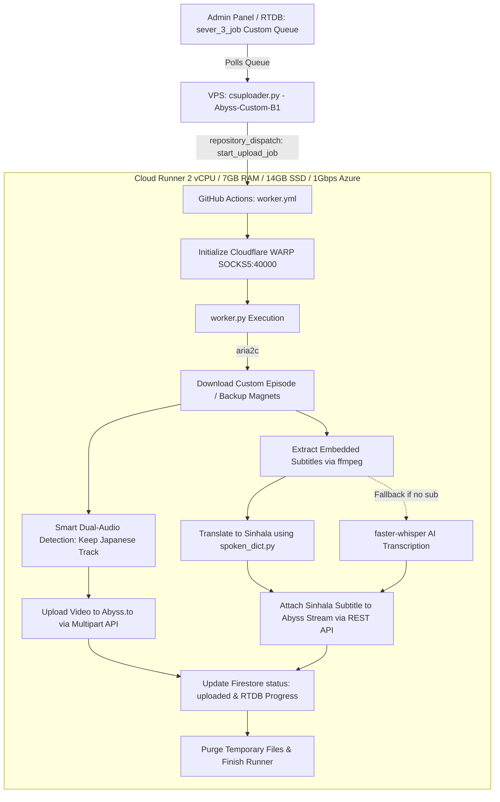

# 🎯 AniShift Server 3 Custom Anime Cloud Worker (`media-processor-Custom`)

[](https://www.python.org/)
[](https://github.com/features/actions)
[](https://www.cloudflare.com/application-services/products/warp/)
[](https://aria2.github.io/)
[](https://ffmpeg.org/)
[](https://github.com/SYSTRAN/faster-whisper)
[](https://firebase.google.com/)

A dedicated cloud processing pipeline engineered exclusively for **AniShift Server 3 Custom & Requested Anime Series/Movies**. Running on a separate, dedicated GitHub Actions repository ensures that user-requested custom anime jobs are processed immediately without queuing behind massive backlog or ongoing tasks.

---

## ⚡ Key Highlights

* **Dedicated High-Priority Pipeline**:
  * Connected to `csuploader.py` (`Abyss-Custom-B1`) on the VPS. Custom jobs (`sever_3_job` node) are dispatched instantly to their own independent cloud runner pool.
* **Concurrency & Load Isolation**:
  * Operates completely decoupled from main backlog workers (`abuploader.py`), preventing runner exhaustion and job starvation.
* **Cloudflare WARP Bypassing**:
  * Establishes a local SOCKS5 proxy via `cloudflare-warp` on port `40000` to guarantee uninterrupted torrent peer discovery, tracker communication, and API reachability.
* **Resilient Torrent Ingestion (`aria2c`)**:
  * High-speed parallel chunk downloading with automated failover through the configured `backup_magnets` list.
* **Smart Dual-Audio Stream Filtering**:
  * Automatically inspects audio streams with `ffprobe`, isolates Japanese voice tracks, and strips redundant foreign dubs for a clean viewing experience.
* **Integrated Subtitle Translation & AI Transcription**:
  * Extracts embedded subtitles from video files via `ffmpeg`.
  * Translates to natural conversational Sinhala using the custom Spoken Sinhala dictionary (`spoken_dict.py`).
  * Automatic `faster-whisper` AI fallback generates accurate subtitles if no native subtitle tracks are present.
* **Direct Abyss Upload & API Attachment**:
  * Streams the processed video to Abyss CDN (`https://up.abyss.to/`).
  * Attaches the translated Sinhala subtitle directly to the video via Abyss REST API.
  * Real-time Firestore document updates (`status: 'uploaded'`, Abyss embed URL, episode metadata) and RTDB worker status reporting.
* **Zero-Waste Disk Management**:
  * Cleans up all working directories and temporary video segments immediately after upload.

---

## 🏗️ Architecture Workflow



---

## 🔑 Required GitHub Actions Secrets

Add the following secret keys under your GitHub Repository **Settings -> Secrets and variables -> Actions**:

| Secret Name | Description | Example / Value |
| :--- | :--- | :--- |
| `FIREBASE_JSON` | Full contents of your `serviceAccountKey.json` | `{ "type": "service_account", ... }` |
| `FIREBASE_DB_URL` | Firebase Realtime Database URL | `https://anishift-5d14b-default-rtdb.firebaseio.com` |
| `ABYSS_API_KEY` | *(Optional Fallback)* Default Abyss API Key | `19136c9e1c8d...` |
| `ABYSS_EMAIL` | *(Optional Fallback)* Abyss Account Email | `account@gmail.com` |
| `ABYSS_PASSWORD` | *(Optional Fallback)* Abyss Account Password | `********` |

> [!NOTE]
> `csuploader.py` dynamically supplies the designated Abyss account credentials with each dispatch payload. The secret fallback variables serve as backup protection.

---

## 📁 Repository Structure

```
├── .github/workflows/
│   └── worker.yml          # GitHub Actions cloud runner definition
├── worker.py               # Cloud processing, torrent download, ffmpeg & Abyss uploader
├── spoken_dict.py          # Spoken Sinhala dictionary & vocabulary translation rules
├── requirements.txt        # Python dependency specifications
└── README.md               # Pipeline documentation
```

---

## 🚀 Running on VPS via PM2

To start the custom anime uploader daemon on your VPS:

```bash
# Navigate to abyss_uploader directory
cd abyss_uploader

# Start with PM2
pm2 start csuploader.py --name "Abyss-Custom-B1" --interpreter python3

# Save PM2 process list
pm2 save
```

---

## 🛡️ License & Credits
Developed exclusively for **AniShift**. All rights reserved.
