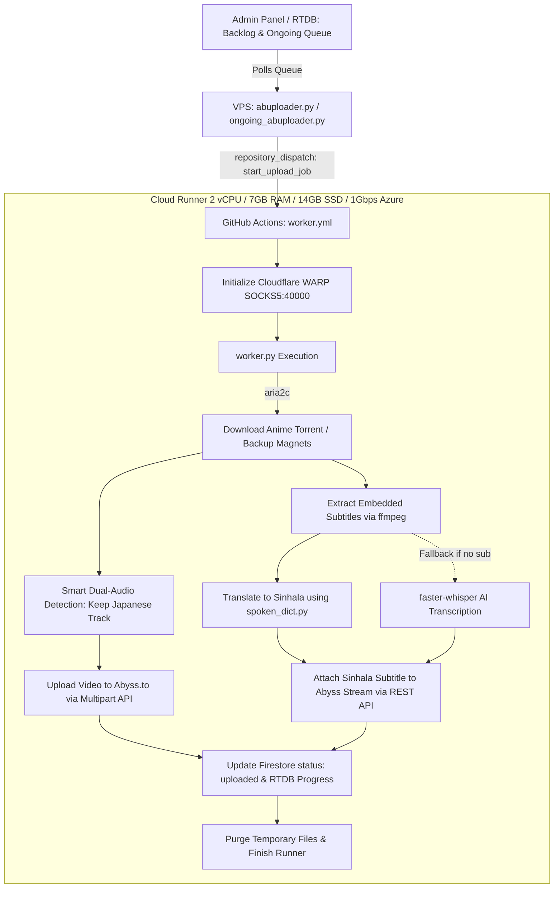

# ⚡ AniShift Server 3 Abyss Cloud Worker (`media-processor`)

[](https://www.python.org/)
[](https://github.com/features/actions)
[](https://www.cloudflare.com/application-services/products/warp/)
[](https://aria2.github.io/)
[](https://ffmpeg.org/)
[](https://github.com/SYSTRAN/faster-whisper)
[](https://firebase.google.com/)

A cloud-native, high-speed automated anime ingestion pipeline for **AniShift Server 3 (Abyss Stream)**. Handles both ongoing releases and automated backlog queue processing by leveraging GitHub Actions ephemeral cloud runners (1Gbps+ Azure network, 14GB SSD, 7GB RAM).

---

## ⚡ Key Highlights

* **Automated Cloud Dispatch**:
  * VPS bots (`abuploader.py` and `ongoing_abuploader.py`) listen for pending episodes and trigger jobs via GitHub `repository_dispatch` (`start_upload_job`).
* **Cloudflare WARP Bypassing**:
  * Automatically sets up and connects `cloudflare-warp` in local SOCKS5 proxy mode (port `40000`) on the runner to bypass torrent ISP blocks, trackers, and API limits.
* **High-Speed Torrent Ingestion**:
  * Downloads video files rapidly using `aria2c` with DHT support, with automatic loop fallback across configured `backup_magnets`.
* **Smart Dual-Audio Management**:
  * Uses `ffprobe` to detect multi-audio containers and automatically selects the original Japanese audio track while discarding unnecessary dub tracks.
* **Intelligent Subtitle Pipeline**:
  * Extracts embedded soft subtitles from MKV/MP4 using `ffmpeg`.
  * Cleans ASS/VTT formatting, vector drawing tags, and RTL markers.
  * Translates English dialogue to natural Sinhala using the custom Spoken Sinhala dictionary (`spoken_dict.py`).
  * Seamlessly falls back to `faster-whisper` AI speech recognition if subtitles are missing.
* **Abyss API Ingestion & Subtitle Attachment**:
  * Uploads video to Abyss CDN (`https://up.abyss.to/`).
  * Attaches the translated Sinhala subtitle directly to the Abyss stream via Abyss REST API.
  * Updates Firestore (`anime_series` / `anime_movies`) with `status: 'uploaded'`, Abyss embed link, and metadata.
* **Zero-Waste Disk Lifecycle**:
  * All downloaded videos and temporary files are purged immediately upon upload completion.

---

## 🏗️ Architecture Workflow



---

## 🔑 Required GitHub Actions Secrets

Add the following secret keys under your GitHub Repository **Settings -> Secrets and variables -> Actions**:

| Secret Name | Description | Example / Value |
| :--- | :--- | :--- |
| `FIREBASE_JSON` | Full contents of your `serviceAccountKey.json` | `{ "type": "service_account", ... }` |
| `FIREBASE_DB_URL` | Firebase Realtime Database URL | `https://anishift-5d14b-default-rtdb.firebaseio.com` |
| `GROQ_API_KEY` | *(Recommended for Studio Subtitles)* Free API key from [Groq Console](https://console.groq.com) | `gsk_...` |
| `GEMINI_API_KEY` | *(Optional Backup AI)* Free Google Gemini API Key | `AIzaSy...` |
| `ABYSS_API_KEY` | *(Optional Fallback)* Default Abyss API Key | `19136c9e1c8d...` |
| `ABYSS_EMAIL` | *(Optional Fallback)* Abyss Account Email | `account@gmail.com` |
| `ABYSS_PASSWORD` | *(Optional Fallback)* Abyss Account Password | `********` |

> [!NOTE]
> The VPS uploaders (`abuploader.py`, `ongoing_abuploader.py`) dynamically pass the active Abyss credentials in `JOB_PAYLOAD` per job. The fallback environment variables are only used if the payload omits them.

---

## 📁 Repository Structure

```
├── .github/workflows/
│   └── worker.yml          # GitHub Actions cloud runner definition
├── worker.py               # Cloud processing, torrent download, ffmpeg & Abyss uploader
├── spoken_dict.py          # Spoken Sinhala dictionary & vocabulary translation rules
├── requirements.txt        # Python dependency specifications
└── README.md               # Pipeline documentation
```

---

## 🚀 Running on VPS via PM2

To run the associated Abyss VPS bots:

```bash
# Start Abyss Backlog Uploaders
pm2 start abuploader.py --name "Abyss-Auto-B1" --interpreter python3
pm2 start abuploader.py --name "Abyss-Auto-B2" --interpreter python3

# Start Abyss Ongoing Uploaders
pm2 start ongoing_abuploader.py --name "Abyss-Ongoing-B1" --interpreter python3

# Save PM2 process list
pm2 save
```

---

## 🛡️ License & Credits
Developed exclusively for **AniShift**. All rights reserved.
